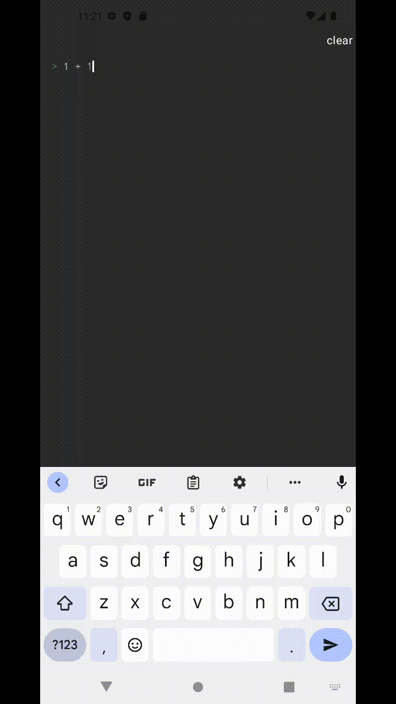

<h1 align="center">Asleh</h1>
<h3 align="center"><em>Android App for the rust written fend library for mathematical calculations</em></h3>

<!---->

### What?

[fend](https://github.com/printfn/fend) is one of my favorite tools to make unit conversions and series of mathematical calculations. I have been using it every now and then using either their official telegram bot or online [demo](https://printfn.github.io/fend/) but i find myself wanting to have it as an app in my phone. Also i have always wanted to use rust + kotlin ffi. This was basically a good project to try.

#### Demo
I have tried to make the ui as straightforward as possible and took some inspirations from the web demo.

#### Try it out.

Official apk builds are provided in release. You can check it out from there. I have tried to make the ui as simple as possible. Enjoy.

#### Contributing
You will be required to have rust and android studio installed inorder to work on this project. You can check out .github/workflows/release.yml to see how we link rust + kotlin. (I will make this easier with nix soon!!)

Enjoy!
